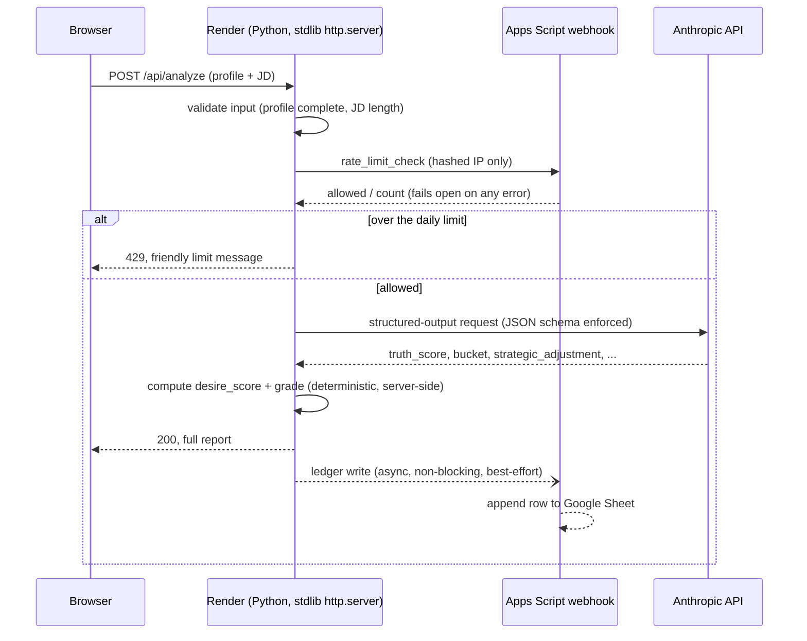

# Architecture

RSF is a small, deliberately boring stack: a stdlib-only Python backend, a
static HTML/CSS/JS frontend, one LLM call per analysis, and a Google Sheet
as the entire "database." No framework, no build step, no ORM, no queue.

## Request flow

Two properties of this flow are deliberate:

1. **The rate-limit check happens before the paid API call, not after.**
   An over-limit request never reaches Anthropic — the check is a gate,
   not an audit log.
2. **The ledger write happens after the user already has their result**,
   on a background thread. A failure writing to the Sheet can never turn
   into a failure the user experiences. See [Testing & hardening](../README.md#testing--production-hardening)
   for the real incident this design decision paid off in.

## Components

| Component | What it is | What it proves |
|---|---|---|
| `backend/usage_gate.py` | Per-IP rate limiter: hashing, atomic counting, an owner-issued override-code mechanism, and a durable backend client that fails open | Building real guardrails around a paid, abusable API surface |
| `backend/structured_output_example.py` | Illustrative Anthropic structured-output call (real pattern, simplified prompt/schema) | Using an LLM as one *component* inside a system with a deterministic, auditable boundary around it, not as the whole system |
| `apps_script/ledger_apps_script.gs` | The actual Google Apps Script webhook code, used for both usage logging and the durable rate-limit counter | A single small integration doing double duty, with locking for concurrency safety and no hardcoded environment-specific values |
| `frontend/usage_gate_ui.js` | Client-side handling of the three states a request can end in (normal / warning / blocked) | The rate limiter has a real UI, not just a backend check |
| `tests/test_usage_gate.py` | Runnable subset of the real 64-test suite | The claims above are tested, not asserted |
| `deploy/render.yaml`, `deploy/.env.example` | The actual deploy config and full environment-variable surface | The system is genuinely deployed, not a local-only demo |

## What's not shown here

The candidate-evaluation logic itself — the system prompt and JSON schema
that actually encode Truth Score, Bucket, Strategic Adjustment, and Desire
Score — lives in a private module (`rsf_prompt.py`) that never leaves the
server and isn't included in this repository. See the README for why.

## Deployment

Render, from a private GitHub repo, auto-deploying on push. No containers,
no CI pipeline beyond Render's own build step (which for a zero-dependency
Python app is just "start the process"). The live product runs on Render's
free tier.
